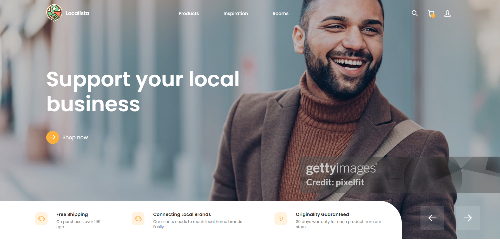
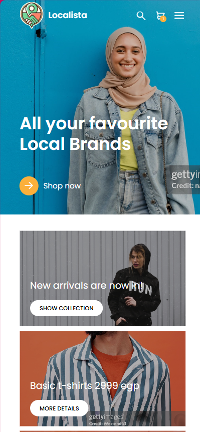
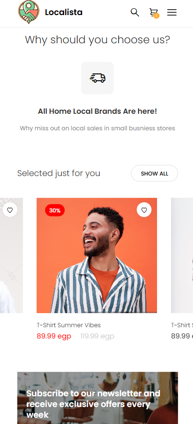
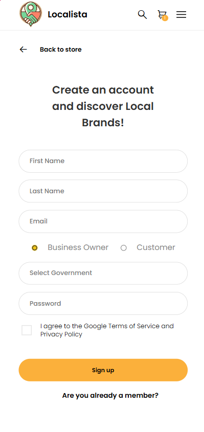
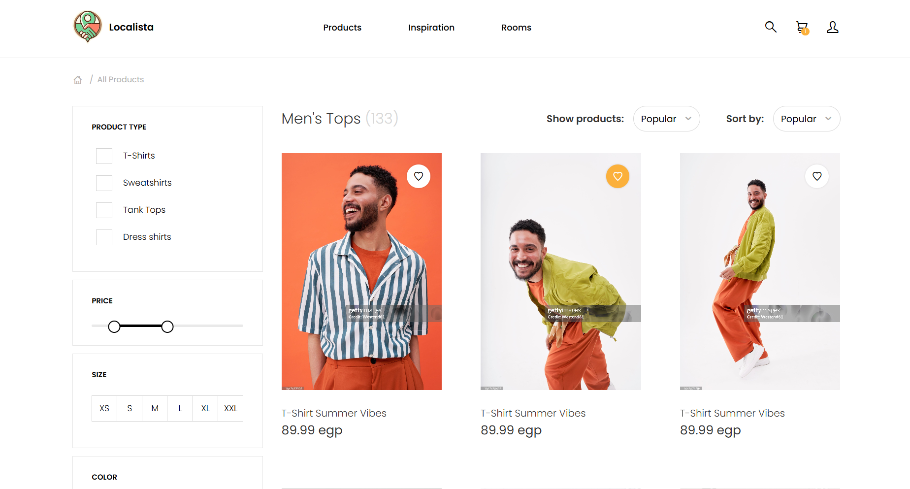
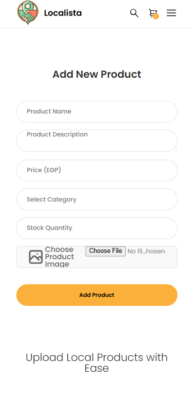
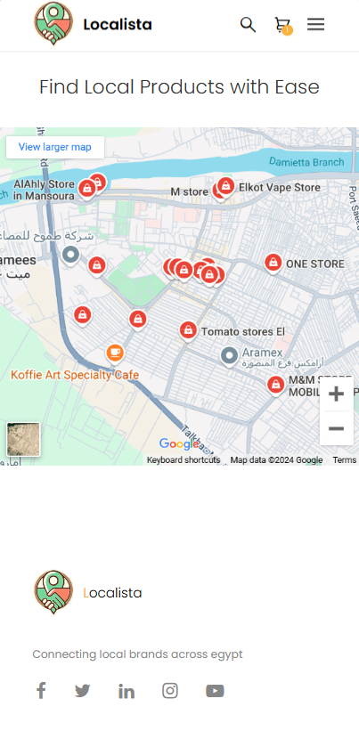
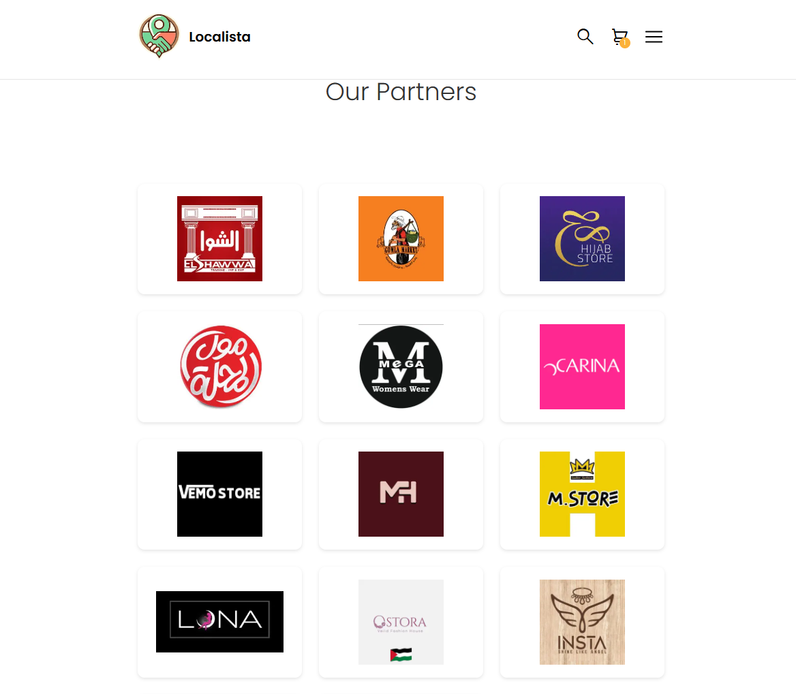
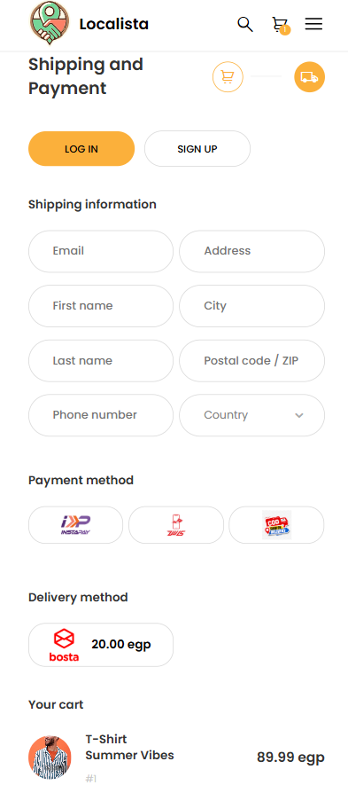

# Bytes 404 :D GDG 24

## LIVE Deploy URL SEE REPO DESCRIPTION

## Presentation
[Here](https://www.canva.com/design/DAGYIV1SXE0/oym_81WdJ1DSwzT1-AX6ug/view?utm_content=DAGYIV1SXE0&utm_campaign=designshare&utm_medium=link&utm_source=editor)

## Screenshots










## DB MODEL

```sh
Atlas atlas-o8kaa1-shard-0 [primary] loca> db.sessions.find()
[
  {
    _id: ObjectId('674c75c0e6844ec626ac8356'),
    sessionID: '305b2626-47cc-4ff7-8772-b568d2032edc',
    email: 'xd@me.me',
    role: 'user',
    date: ISODate('2024-12-01T14:42:08.250Z')
  }
]
Atlas atlas-o8kaa1-shard-0 [primary] loca> db.users.find()
[
  {
    _id: ObjectId('674c75b8e6844ec626ac8355'),
    email: 'xd@me.me',
    password: '$2b$10$mEsUBwI5h2PtTRaLMfo7M.E0jhwBzFgvrvSUZHV9f1zpymHs0Zs4C',
    F_name: 'xd',
    L_name: 'qq',
    city: 'cairo',
    age: '21',
    role: 'user',
    created_at: ISODate('2024-12-01T14:42:00.162Z')
  }
]
```

## Authors

- Noor Amjad - [GitHub](https://github.com/Justxd22) / [Twitter](https://twitter.com/_xd222) / [LinkedIn](https://www.linkedin.com/in/noor-amjad-xd)
- Wagdy Adel
- Eman Khaled
- Eman Magdy
- Engy Mohammed

## License

Copyright (C) 2024
Licensed under the GPLv3 License


# TO:DO 
- Brainstorm IDEA
- Presentaion 
- Video


# ROLES

- Busniess
    + Write Models
    + Find Numbers
    + CAC

- Technical 
    + Graphic
    + Presentation
    + Videograpghy 
    + Documenting
    + Find new features

- Dev (2 people)
    + App/Web dev 
    + DevOps
    + Automation/Deploying
    + Cloud Setup

- Testing & Offloading
    + Test code
    + Find Bugs & assign to dev
    + Manage presentation
    + Handle side tasks
